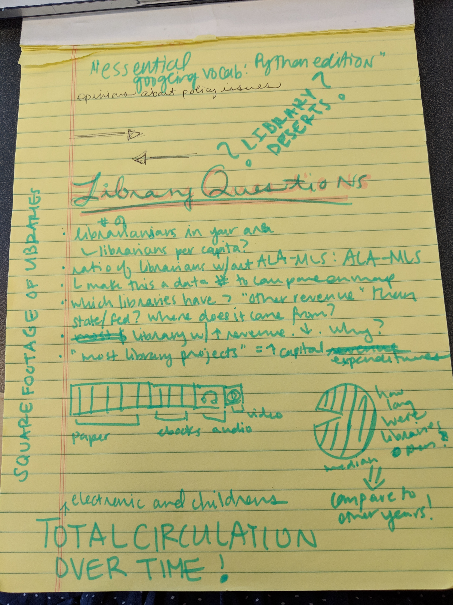

# Public Libraries

## Source

* [The Institute of Museum and Library Services](https://www.imls.gov/research-evaluation/data-collection/public-libraries-survey/explore-pls-data/pls-data)

## Questions/Concerns

* number of librarians in your area
    * librarians per capita?
* ratio of libraries without ALA-MLS: with ALA-MLS
* which libraries have > "other revenue" than state/fed? where does it come from?
* libraries with highest/lowest revenue. why?
* "most library projects" = most capital expenditures
* square footage of libraries in a state (heat map)
* how long were libraries open each year?
* total circulation over time
    * e-books!

